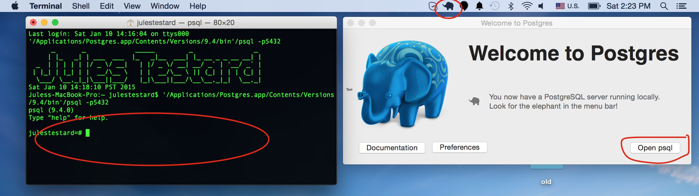
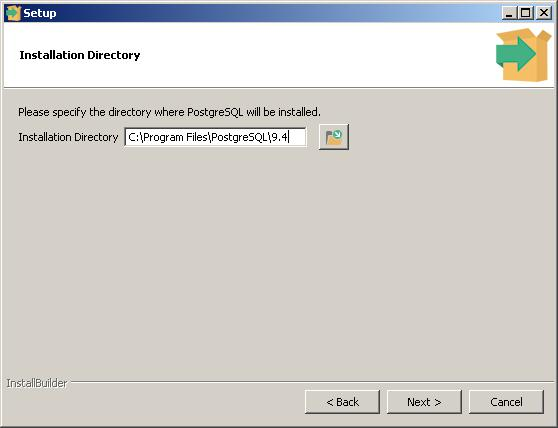
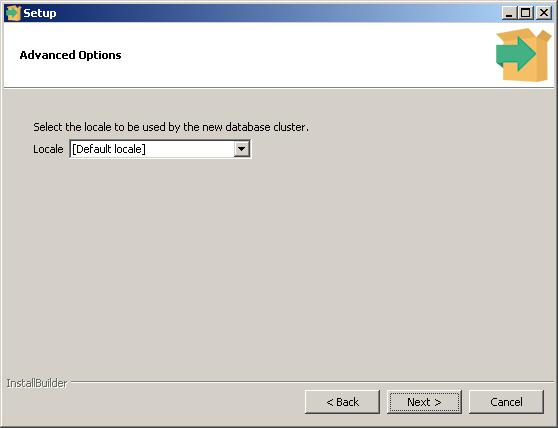
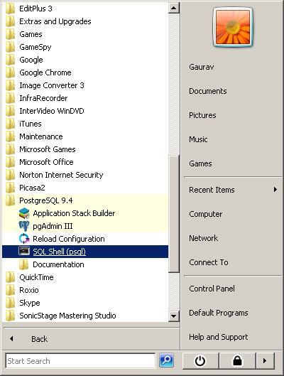
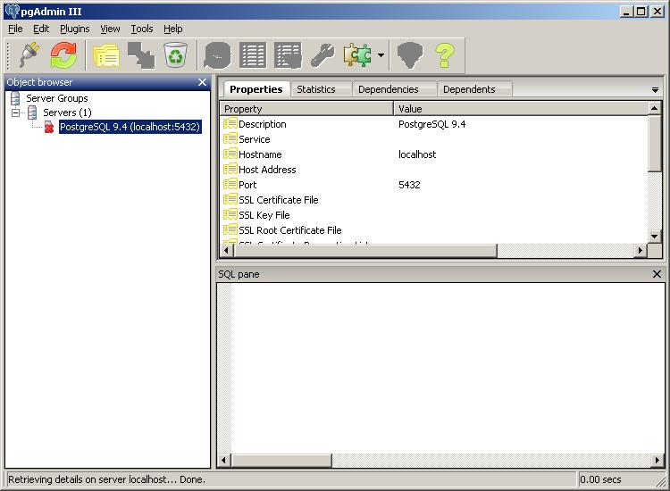

# MAS-DSE-201-Support
This repository is made to help students of the MAS DSE 201 course offered in Winter 2015 at UCSD. It contains documentation on software required for the course.

## Install PostgreSQL

### Mac OS X

1. The recommended way to install PostgreSQL in Mac OS X is using [Postgres.app](http://postgresapp.com/). Follow the instructions on the website to install the software. This will install PostgreSQL version 9.4.
2. Once you installed the application, launch it and you should see a small elephant on your toolbar (see screenshot). )
3. Click on "Open psql" and you are presented with an interactive shell you can use for SQL commands.

### Linux (Ubuntu)

1. The first step is to install postgres with the following PostgreSQL as follows : run `sudo apt-get install postgresql` on the terminal. Verify that the installed version of PostgreSQL will be 9.3 or 9.4 (this should be the case by default). Any of the two should be fine. 
2. Run `sudo -u postgres createuser -s <username>` on the terminal. By default, the PostgreSQL installation will install a user called `postgres` which will have the administrator role (highest level of privilege). In our case, it is OK to have our own user be a super user as well. This command creates a new user (which bears our own name) and gives it administrator powers.
3. Run `createdb <username>` on the terminal. This will create a database whose name is the same as our own name.
4. Run `psql` on the terminal and you will have a client session to your database. Note that `psql` is a shorthand for `psql -U <username> -d <username>`, which means "create a client connection to the database \<username> as user \<username>".
5. 

### Windows
1. Download [Postgresql 9.4](http://www.enterprisedb.com/products-services-training/pgdownload#windows) 
2. Click Next
 
3. Click Next

4. Provide password (e.g. postgres)

5. Click Next

6. Click Next

7. Click Next

8. Click Finish

9. Launch psql and put in password for user postgres (defaults for other fields is ok for now)

10. Launch pgAdmin

11. Double click on PostgresSQL 9.4 and put in the password for user postgres

